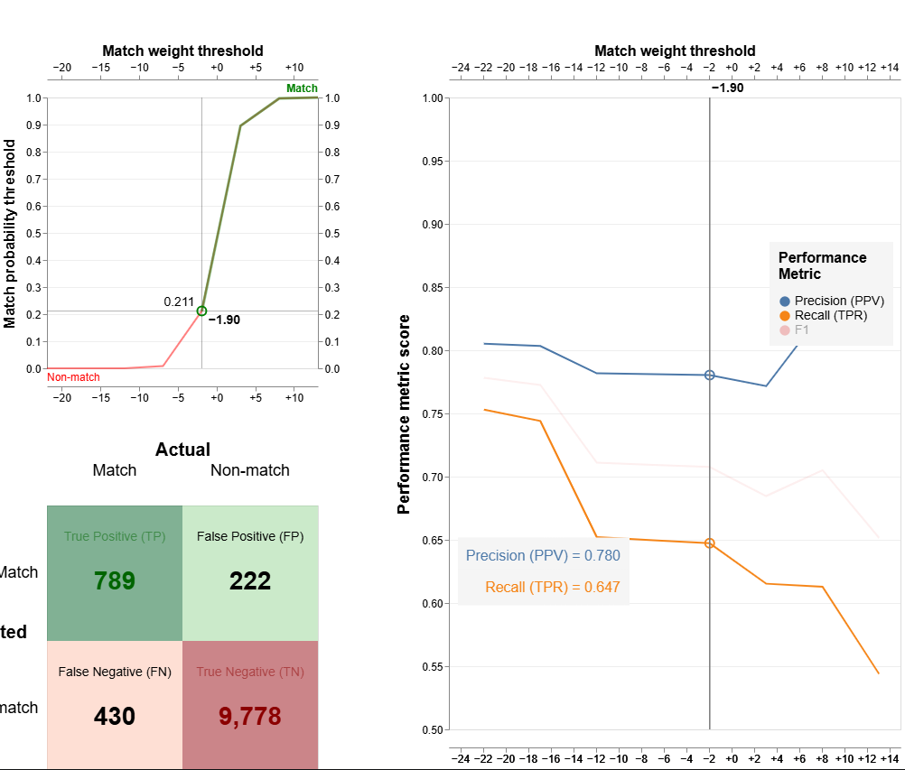
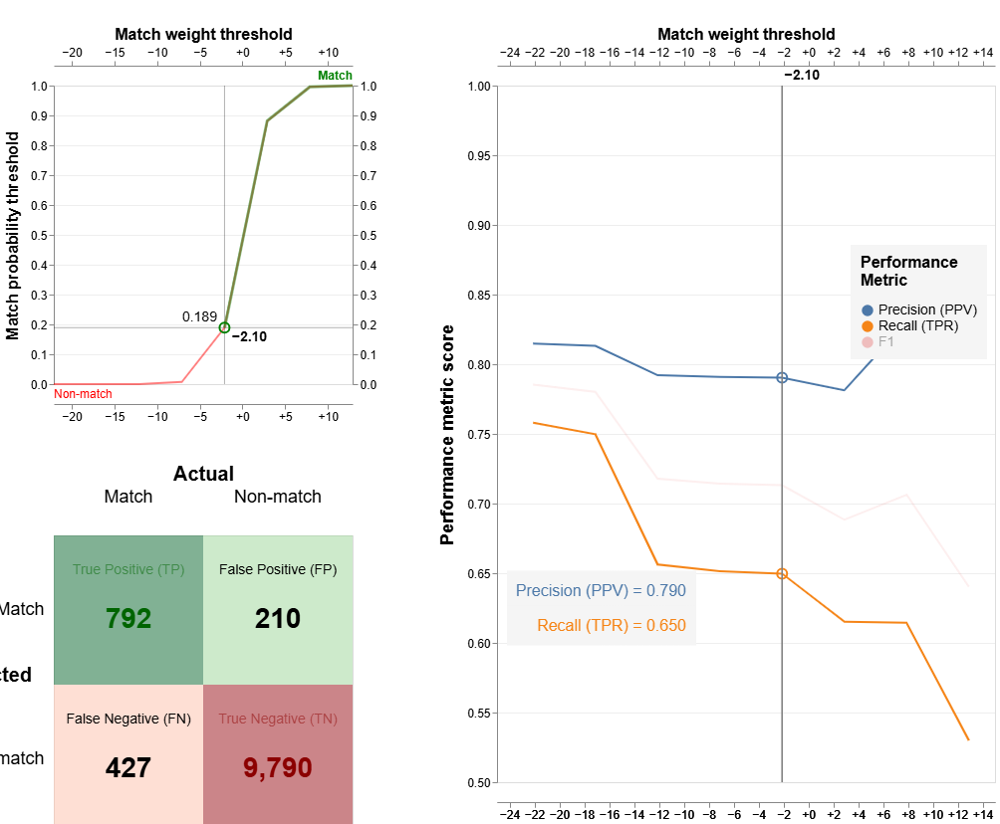
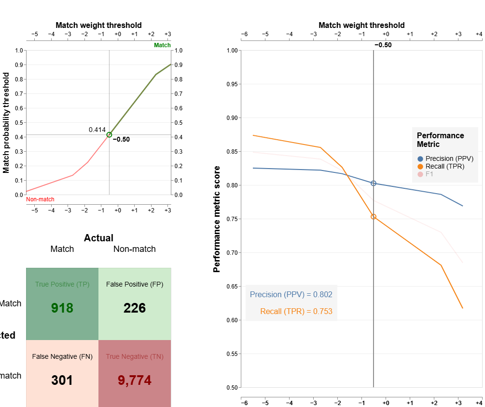
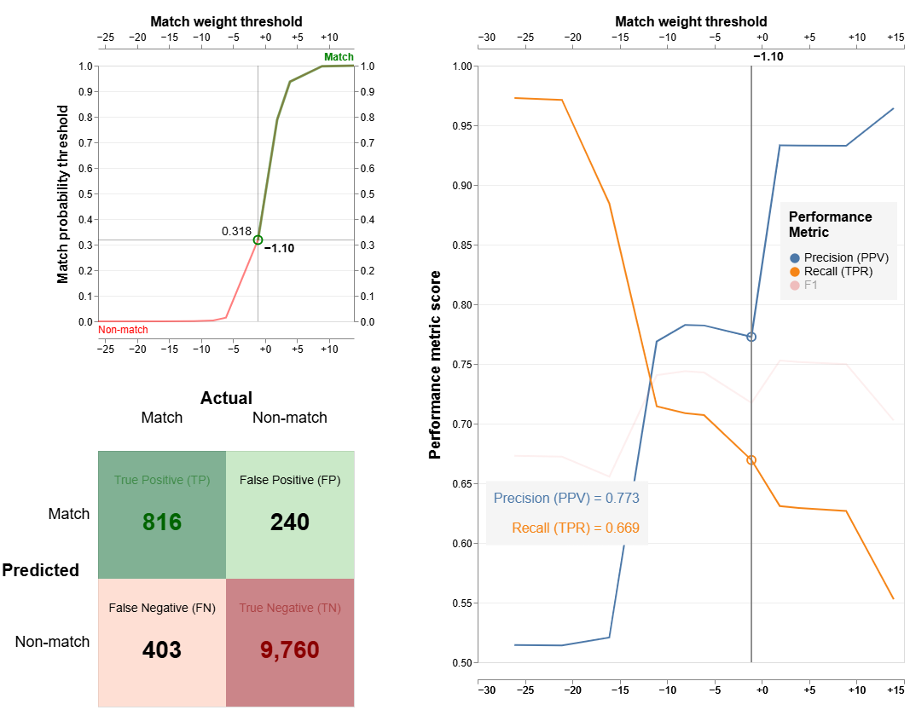

# EntityResolutionExploration

## Table of Contents
- [Why Entity Resolution](#why-entity-resolution)
- [Preprocessing of "Messy Data"](#preprocessing-of-messy-data)
  - [__precleaning](__precleaning)
  - [__preprocessRecipients](__preprocessRecipients)
- [Entity Resolution methods](entity-resolution-methods)
  - [__add_entity_ids_m1](__add_entity_ids_m1)
  - [__add_entity_ids_m2](__add_entity_ids_m2)
  - [__add_entity_ids_m3](__add_entity_ids_m3)
  - [__add_entity_ids_m4](__add_entity_ids_m4)
- [Analysis](analysis)
  - [Multi Model Analysis](multi-model-analysis)
  - [Improvements](improvements)


## Why Entity Resolution?
Entity resolution is helpful when presented with a large dataset of many duplicates, that cannot be feasibly cleaned and labeled by hand. In the case of this project the dataset used is only 500 lines, and pre-labeled, so I am able to check my methods against a "base-truth". Or in the case of the generated data I make (utilizing faker with seed 42), I have a `global dist_e` to be able to check for the number of entities. 

All of these options do still fail in the case that I am both the red and blue teams, and know what the outcomes *should* be, so I can write my methods to maximise on the expectations.

## Preprocessing of "Messy Data"
The data that I am using in the three datasets I explored (10 lines, 500 lines, 10,000 lines) has "messy" data, that to maximise the effectiveness of the ML resolution, needs to be precleaned. these "pre-cleaning" methods are as follows:

```python
def __precleaning(entry):
    entry = entry.upper()
    entry = entry.replace(",", " ")
    entry = re.sub(r' +', ' ', entry)
...
```
#### __precleaning
Standardizes a raw entity string before any structured parsing.

 - Uppercases and strips punctuation/special characters
 - Collapses extra whitespace
 - Detects and appends a US country suffix if the entity appears to be American
 - Replaces company monikers, state names, and country names with their canonical abbreviations/ISO codes — first via phrase-level substitution, then token-by-token
 - Removes adjacent duplicate tokens and normalizes "USA" --> "US"

```python
def __preprocessRecipients(entity_str):
    entity_str = entity_str.strip()
    country_guess = entity_str[-2:].upper()
    country_obj = pycountry.countries.get(alpha_2=country_guess)
...
```

#### __preprocessRecipients
Parses a raw entity string into structured components.

 - Country: checks the last two characters as an ISO alpha-2 code; falls back to scanning the full string for a country name or code
 - Company moniker: searches for known legal suffixes (LLC, Inc., etc.) to bound the entity name
 - State: looks for a US state ISO code in the remaining string
 - ZIP code: extracts a 5-digit US ZIP using a regex
 - Returns a dict with keys: `entity_name`, `address_and_city`, `state`, `zip`, `country`

## Entity Resolution methods
I built out 4 different ER deduplication models, these are as follows:

```python
def __add_entity_ids_m1(entities):
    df = pd.DataFrame(entities)
    df["unique_id"] = df.index.astype(str)

    comparisons = [
        cl.ExactMatch("entity_name"),
        cl.LevenshteinAtThresholds("entity_name"),
        cl.ExactMatch("country"),
        cl.ExactMatch("state"),
        cl.ExactMatch("address_and_city"),
    ]

    blocking_rules = [
        "l.entity_name = r.entity_name",
        "(l.country = r.country) and (l.state = r.state)",
        "(l.entity_name = r.entity_name and l.country = r.country)",
        "levenshtein(l.entity_name, r.entity_name) < 2",
    ]

    settings = {
        "link_type": "dedupe_only",
        "unique_id_column_name": "unique_id",
        "blocking_rules_to_generate_predictions": blocking_rules,
        "comparisons": comparisons
    }

    db_api = DuckDBAPI()
    linker = Linker(df, settings, db_api)

    df_pred = linker.inference.predict(threshold_match_probability=0.7)
    cluster_df = linker.clustering.cluster_pairwise_predictions_at_threshold(df_pred, threshold_match_probability=0.95).as_pandas_dataframe()
    cluster_dict = cluster_df.set_index("entity_name")["cluster_id"].to_dict()

    for e in entities:
        e["entity_id"] = cluster_dict.get(e["entity_name"])
        
    return entities
```

#### __add_entity_ids_m1
A conservative matcher using standard Splink. It relies on Exact Match and Levenshtein logic with fixed thresholds. It is best for clean datasets where matches are structurally nearly identical, or as a "proof of concept" when using data cleaning methods

```python
def __add_entity_ids_m2(entities):
    df = pd.DataFrame(entities)
    df["unique_id"] = range(len(df))

    entity_name_comparison = {
        "output_column_name": "entity_name",
        "comparison_levels": [
            NullLevel("entity_name"),
            {
                "sql_condition": '"entity_name_l" = "entity_name_r"',
                "label_for_charts": "Exact match",
                "m_probability": 0.9999,
                "u_probability": 0.00001,
            },
            LevenshteinLevel("entity_name", 1).configure(m_probability=0.9),
            LevenshteinLevel("entity_name", 2).configure(m_probability=0.7),
            ElseLevel()
        ]
    }

    comparisons = [
        entity_name_comparison,
        cl.ExactMatch("country").configure(
            m_probabilities=[0.51, 0.49], 
            u_probabilities=[0.50, 0.50]
        ),
        cl.ExactMatch("state").configure(
            m_probabilities=[0.51, 0.49], 
            u_probabilities=[0.50, 0.50]
        ),
        {
            "output_column_name": "address_and_city",
            "comparison_levels": [
                NullLevel("address_and_city"),
                ExactMatchLevel("address_and_city").configure(m_probability=0.55),
                ElseLevel().configure(m_probability=0.45)
            ]
        }
    ]

    blocking_rules = [
        "1=1"
    ]

    settings = {
        "link_type": "dedupe_only",
        "unique_id_column_name": "unique_id",
        "blocking_rules_to_generate_predictions": blocking_rules,
        "comparisons": comparisons,
    }

    db_api = DuckDBAPI()
    linker = Linker(df, settings, db_api)

    linker.training.estimate_u_using_random_sampling(max_pairs=1e5)
    linker.training.estimate_parameters_using_expectation_maximisation("l.entity_name = r.entity_name")

    df_pred = linker.inference.predict(threshold_match_probability=0.01)
    
    cluster_df = linker.clustering.cluster_pairwise_predictions_at_threshold(
        df_pred, threshold_match_probability=0.01
    ).as_pandas_dataframe()
    
    cluster_dict = cluster_df.set_index("unique_id")["cluster_id"].to_dict()

    for i, e in enumerate(entities):
        e["entity_id"] = cluster_dict.get(i, f"unique_{i}")

    return entities
```

#### __add_entity_ids_m2
Uses a granular, custom-defined hierarchy (Levenshtein levels 1–3) and a two-stage expectation/maximization training process. By cross-training weights between names and addresses, it effectively learns to ignore specific simulated OCR noise (either with provided datasets or with below dataset builders' simulators) and whitespace artifacts.

```python
def __add_entity_ids_m3(entities):
    df = pd.DataFrame(entities)
    df["unique_id"] = range(len(df))

    comparisons = [
        {
            "output_column_name": "entity_name",
            "comparison_levels": [
                cll.NullLevel("entity_name"),
                cll.ExactMatchLevel("entity_name").configure(m_probability=0.99),
                cll.JaroWinklerLevel("entity_name", 0.95).configure(m_probability=0.90),
                cll.JaroWinklerLevel("entity_name", 0.88).configure(m_probability=0.80),
                cll.JaroWinklerLevel("entity_name", 0.70).configure(m_probability=0.70),
                cll.ElseLevel()
            ],
        },
        cl.ExactMatch("country"),
        cl.ExactMatch("state"),
        cl.LevenshteinAtThresholds("address_and_city", [2, 4]),
    ]

    blocking_rules = [
        "l.entity_name = r.entity_name",
        "(l.country = r.country) and (l.state = r.state)",
        "levenshtein(l.entity_name, r.entity_name) <= 2",
        "jaro_winkler_similarity(l.entity_name, r.entity_name) >= 0.90",
    ]

    settings = {
        "link_type": "dedupe_only",
        "unique_id_column_name": "unique_id",
        "blocking_rules_to_generate_predictions": blocking_rules,
        "comparisons": comparisons,
        "retain_intermediate_calculation_columns": True,
        "retain_matching_columns": True,
        "probability_two_random_records_match": 0.01 
    }

    db_api = DuckDBAPI()
    linker = Linker(df, settings, db_api)
    
    
    try:
        linker.training.estimate_parameters_using_expectation_maximisation(
            "levenshtein(l.entity_name, r.entity_name) <= 3"
        )
        linker.training.estimate_parameters_using_expectation_maximisation(
            "(l.country = r.country) and (l.state = r.state)"
        )
    except Exception as e:
        print(f"Warning: EM training failed. Error: {e}")

    df_pred = linker.inference.predict(threshold_match_probability=0.01)
    
    cluster_df = linker.clustering.cluster_pairwise_predictions_at_threshold(
        df_pred, threshold_match_probability=0.1
    ).as_pandas_dataframe()
    
    cluster_dict = cluster_df.set_index("unique_id")["cluster_id"].to_dict()

    for i, e in enumerate(entities):
        e["entity_id"] = cluster_dict.get(i)

    df_clusters = linker.clustering.cluster_pairwise_predictions_at_threshold(df_pred, threshold_match_probability=0.1)

    linker.visualisations.cluster_studio_dashboard(
        df_pred, df_clusters, "cluster_studio.html", sampling_method="by_cluster_size", overwrite=True
    )

    return entities
```

#### __add_entity_ids_m3
A fuzzy-first approach prioritizing Jaro-Winkler to reward correct starts of entity names (prefixes "p" see [here](https://en.wikipedia.org/wiki/Jaro%E2%80%93Winkler_distance)). It uses broad probabilistic blocking and automated weight estimation, making it the most robust choice for inconsistent, messy real-world data. 

```python
def __add_entity_ids_m4(entities):
    df = pd.DataFrame(entities)
    df["unique_id"] = range(len(df))
    
    settings = SettingsCreator(
        link_type="dedupe_only",
        unique_id_column_name="unique_id",
        comparisons=[
            cl.ExactMatch("entity_name"),
            {
                "output_column_name": "entity_name",
                "comparison_levels": [
                    cll.ExactMatchLevel("entity_name"),
                    cll.LevenshteinLevel("entity_name", 2),
                    cll.JaroWinklerLevel("entity_name", 0.7),
                    cll.ElseLevel(),
                ],
            },
            cl.ExactMatch("country"),
            cl.ExactMatch("state"),
            cl.LevenshteinAtThresholds("address_and_city", [2, 4]),
        ],
        blocking_rules_to_generate_predictions=[
            "l.entity_name = r.entity_name",
            "levenshtein(l.entity_name, r.entity_name) <= 5",
            "jaro_winkler_similarity(l.entity_name, r.entity_name) > 0.8"
        ],
        retain_intermediate_calculation_columns=True,
    )

    db_api = DuckDBAPI()
    linker = Linker(df, settings, db_api)

    linker.training.estimate_parameters_using_expectation_maximisation("l.entity_name = r.entity_name")
    linker.training.estimate_parameters_using_expectation_maximisation("levenshtein(l.entity_name, r.entity_name) <= 2")
    
    df_pred = linker.inference.predict(threshold_match_probability=0.50)
    
    cluster_df = linker.clustering.cluster_pairwise_predictions_at_threshold(df_pred, threshold_match_probability=0.95).as_pandas_dataframe()
    
    cluster_dict = cluster_df.set_index("unique_id")["cluster_id"].to_dict()

    for i, e in enumerate(entities):
        e["entity_id"] = cluster_dict.get(i, f"unique_{i}")

    return entities
```

#### __add_entity_ids_m4
This model takes the meandering approach of `m3` with a tighter blocking chunk out of `m1`

## Analysis
#### Multi Model Analysis
I built out 3 different models to assign `entity_id`'s to the same dataset; m1 is a proof of concept and is quite simple. That being said, it is probably the most useful for datasets where the amount of information on a per-entry basis is reletively sparse, for example the data sets used here. m2 and m3 are more complex and allowed for me to work with the Splink libraries' training functionality, however, lacking the information richness on a per line basis, does not perform nearly as well on the given datasets.

1) `__add_entity_ids_m1` (Baseline Heuristic)
A conservative matcher using standard Splink. It relies on Exact Match and Levenshtein logic with fixed thresholds. It is best for clean datasets where matches are structurally nearly identical, or as a "proof of concept" when using data cleaning methods

2) `__add_entity_ids_m2` (Cross-Trained Custom EM)
Uses a granular, custom-defined hierarchy (Levenshtein levels 1–3) and a two-stage expectation/maximization training process. By cross-training weights between names and addresses, it effectively learns to ignore specific simulated OCR noise (either with provided datasets or with below dataset builders' simulators) and whitespace artifacts.

3) `__add_entity_ids_m3` (Hybrid Fuzzy EM)
A fuzzy-first approach prioritizing Jaro-Winkler to reward correct starts of entity names (prefixes "p" see [here](https://en.wikipedia.org/wiki/Jaro%E2%80%93Winkler_distance)). It uses broad probabilistic blocking and automated weight estimation, making it the most robust choice for inconsistent, messy real-world data.

4) `__add_entity_ids_m4` (Best of both worlds)
This model takes the meandering approach of `m3` with a tighter blocking chunk out of `m1`

#### Model Overall Efficacy
This section explores how each of the models performed according to specific metrics. Metrics are defined as:
 - F1 Score: A balanced number (out of 100) that penalizes being off on either precision or recal. As far as I can tell, good metric to judge a model by
 - Internal Consistancy: only measures if the model is consistant with itself, not a great metric. Mostly added as an excersice from [here](https://en.wikipedia.org/wiki/Internal_consistency)

**What is precision?** precision is how often a model correctly matches two entities
**What is recall?** recall is how often the model correctly catches true duplicate entities


**m1**

Precision:  50.57%

Recall:     93.30%

F1 Score:   65.59%

Internal Consistency (avg): 81.15%

This is likely because m1 is conservative matcher using standard Splink (see low precision wiht high recall). It relies on Exact Match and Levenshtein logic with fixed thresholds. Because the provided dataset is *reletively* clean (i.e. no linebreaks, no corrupted data, very little in the way of information on a per line basis)

**m2**

Precision:  100.00%

Recall:     8.50%

F1 Score:   15.67%

Internal Consistency (avg): 48.66%

This is a likely outcome because the addresses are so incomplete and I could not get the null non-matching working. Definately the weakest model of the 3

**m3**

Precision:  19.75%

Recall:     97.32%

F1 Score:   32.83%

Internal Consistency (avg): 91.06%

This model was the one I worked the most on, and also had the heighest hope for. I assumed the Jaro-Winkler methodology would perform well by looking for the first portion of the entity name, and weighting that more heavily. Unfortunatly, this method often lead to unrealted entity getting oversprayed, and as I let up on entity prefixes weight, the flaws with the rest of the model reared their heads.

**m4**

Precision:  100.00%

Recall:     93.00%

F1 Score:   96.37%

Internal Consistency (avg): 80.31%

This high F1 score is to be expected, `m4` takes the best aspects from `m1` (high recall due to blocking rules carried over) and `m2` (high precision). This model also uses the standard `SettingsCreator` library, and I think that leads to far better performance. The teired name weighting scheme also lends well to a dataset that only fully populates the `entity_name` column. Likely this model is not useful for datasets other than the one it is trained on, however, it performs increadibly when presented with an "expected" dataset.

### Models "top 10" Labeled Entities
**m1**
| Rank | Entity ID | Count | Name |
| :--- | :--- | :--- | :--- |
| 1 | 101 | 201 | ACME INVESTMENTS LTD |
| 2 | 13 | 49 | ACME TRUST |
| 3 | 220 | 42 | ACME TRADING LTD |
| 4 | 168 | 32 | NORTH SEA SHIPPING BV |
| 5 | 10 | 26 | TYCHO FEEDER FUND |
| 6 | 147 | 13 | ALPHA TRUST |
| 7 | 100 | 13 | A CME TRUST |
| 8 | 190 | 10 | BANK OF CYPRUS |
| 9 | 362 | 10 | HARBOR ADVISORS LP |
| 10 | 381 | 8 | GLOBAL HOLDINGS LTD |

**m2**
| Rank | Entity ID | Count | Name |
| :--- | :--- | :--- | :--- |
| 1 | 8 | 73 | ACME INVESTMENTS LTD |
| 2 | 44 | 24 | ACME INVESTMENTS LTD |
| 3 | 16 | 23 | A CME INVESTMENTS LTD |
| 4 | 9 | 21 | ACME INVESTMENTS LTD |
| 5 | 39 | 18 | A CME TRUST |
| 6 | 51 | 17 | A CME INVESTMENTS LTD |
| 7 | 57 | 17 | A CME TRA DING LTD |
| 8 | 28 | 13 | ACME INVESTMENTS LTD |
| 9 | 31 | 13 | A CME TRADING LTD |
| 10 | 48 | 10 | BANK OF CYPRUS |

**m3**
| Rank | Entity ID | Count | Name |
| :--- | :--- | :--- | :--- |
| 1 | 8 | 126 | ACME INVESTMENTS LTD |
| 2 | 16 | 53 | A CME INVESTMENTS LTD |
| 3 | 13 | 28 | PA CIFIC TRUST |
| 4 | 44 | 24 | ACME INVESTMENTS LTD |
| 5 | 9 | 21 | ACME INVESTMENTS LTD |
| 6 | 51 | 17 | A CME INVESTMENTS LTD |
| 7 | 28 | 13 | ACME INVESTMENTS LTD |
| 8 | 27 | 12 | BA NK OF CYPRUS |
| 9 | 85 | 10 | ACME TRUST |
| 10 | 91 | 9 | ACME TRADING LTD |

**m4**
| Rank | Entity ID | Count | Name |
| :--- | :--- | :--- | :--- |
| 1 | 8 | 171 | ACME INVESTMENTS LTD |
| 2 | 7 | 56 | ACME TRUST INC |
| 3 | 31 | 47 | ACME TRADING LTD |
| 4 | 53 | 32 | NORTH SEA SHIPPING BV |
| 5 | 6 | 26 | TYCHO FEEDER FUND |
| 6 | 35 | 15 | GLOBAL METALS SA |
| 7 | 27 | 12 | BANK OF CYPRUS |
| 8 | 12 | 11 | GLOBAL HOLDINGS LTD |
| 9 | 19 | 11 | EASTERN MERCHANTS PTE LTD |
| 10 | 26 | 10 | HARBOR ADVISORS LP |

**actual**
| Rank | Entity ID | Count | Name |
| :--- | :--- | :--- | :--- |
| 1 | G001 | 171 | ACME INVESTMENTS LTD |
| 2 | G004 | 56 | ACME TRUST INC |
| 3 | G003 | 55 | ACME TRADING LTD |
| 4 | G006 | 34 | BANK OF CYPRUS |
| 5 | G008 | 32 | NORTH SEA SHIPPING BV |
| 6 | G005 | 26 | TYCHO FEEDER FUND INC |
| 7 | G007 | 24 | GLOBAL METALS SA |
| 8 | G009 | 19 | HARBOR ADVISORS LP |
| 9 | G011 | 18 | ALPHA TRUST FBO JANE DOE |
| 10 | G019 | 16 | EASTERN MERCHANTS PTE LTD |

For model 1 Out of the 124,750 possible matches in the 500 labeled sample, our ER process matched 93.3% of them to 43 entities.

For model 2 Out of the 124,750 possible matches in the 500 labeled sample, our ER process matched 8.5% of them to 237 entities.

For model 3 Out of the 124,750 possible matches in the 500 labeled sample, our ER process matched 97.3% of them to 22 entities.

For model 4 Out of the 124,750 possible matches in the 500 labeled sample, our ER process matched 93.0% of them to 48 entities.









Based on my top 10 entries and our overall model consistancy, in addition to my truth table (associated with my best model, m1), the 3 models struggle the most with assigning false negatives. This is likely a better outcome than seeing more false positives. That being said where the model struggles is determining entities with negative weights in concerns to a missing or undetected address, country, state, and zip. Without *only* looking at entity names, our models struggle to assign the same entity to the correct entity group if an address *was* provided for one, but not the other.

#### Improvements

1) Null detection - null detection **has** been added to all 3 models but some part of the null detection is malfunctioning or not weighted heavily enough. This can likely be remidied by reading through the actual libraries themselves.
2) Better data cleaning - spaces disproportionately mess up Jaro-Winkler training. Given the two names `ACME INVESTMENTS LTD` and `A CME INVESTMENTS LTD` Jaro-Winkler would be disproportionatly negatively effected due to the fact that the space if part of our "prefix", whereas just using Levanshtein groups things like `ACME TRADING LTD` `ACME TRUST INC` because of the low character swaps.
3) More training data - With more "full" data, likely model training would be much better, `m2` and `m3` were disproportionatly effected as they would be more accurate (hypothesis) with 5000+ entries for training, with each entry being flushed out. `m4` displays this well as it does better on a smaller dataset.


